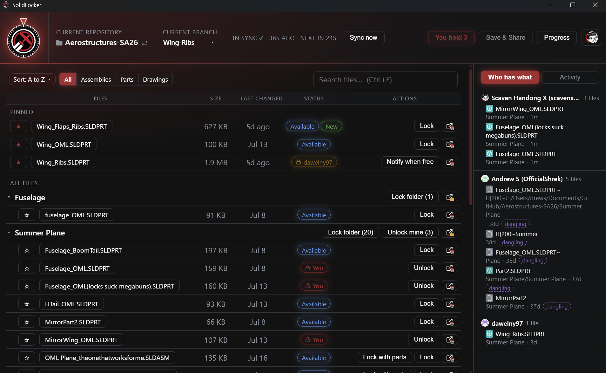
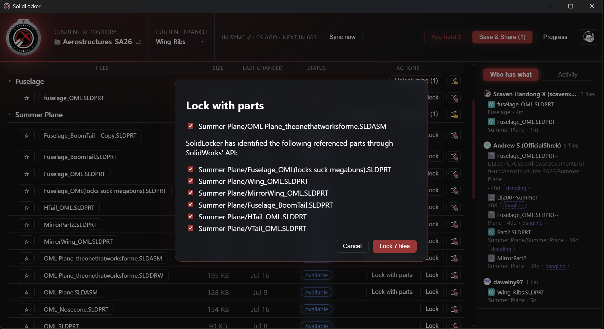
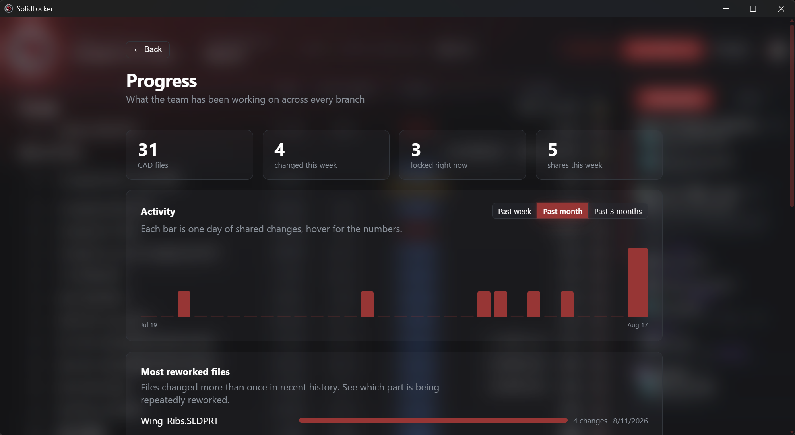

<p align="center">
  
</p>

# SolidLocker
SolidLocker keeps your team's SolidWorks files from stepping on each other. It
locks each part to one person at a time, and it's as easy as a single click, so
you never have to learn Git to use it. Lock an assembly or a drawing and every
part inside it gets locked too, all in that same click.

Built on Git and Git LFS, so your files and their full history live in your
team's GitHub repo. Nothing new to log into, no server to run.

Developed by [Scaven X](https://github.com/scavenx) at RU Airborne.

<p align="center">
  
  <br>
  <em>The dashboard: every file's lock status at a glance, with who holds what on the right.</em>
</p>

<p align="center">
  
  <br>
  <em>Lock with parts: SolidLocker reads a drawing or assembly's references straight from your running SolidWorks and locks the whole set in one click.</em>
</p>

<p align="center">
  
  <br>
  <em>The Progress page: what the team has worked on across every branch.</em>
</p>

## The problem it solves

You can't merge two SolidWorks files. If two people open the same part and both
save, one save wins and the other person's work is just gone. The usual fix is
calling dibs in the group chat, which falls apart the second two messages cross.

SolidLocker replaces coordination by chat with an actual file locking system. When you lock a file, that
lock gets recorded on GitHub's servers right away, and the server only ever lets
one person hold a file at a time, so two people grabbing the same part is
impossible by design. Until you lock a file it stays read only on your computer,
so you can't accidentally edit something that isn't yours.

There's no server to run and no separate account to make. SolidLocker
just uses your team's existing GitHub repo and your own GitHub sign in.


## Getting started

### Requirements

- Windows 10 or 11.
- Git and Git LFS, signed in to GitHub (GitHub Desktop provides all of this).
- A GitHub repository that uses Git LFS with SolidWorks files marked
  `lockable`.
- SolidWorks, for the "lock with parts" detection.

### Install

1. Download the latest `SolidLocker_x64-setup.exe` from the [Releases](https://github.com/RU-Airborne/SolidLocker/releases) page
   and run it.
2. Open SolidLocker and point it at your team's project folder (a local clone of
   the GitHub repository).

### First run

SolidLocker needs Git and Git LFS on your computer, plus a GitHub sign in. The
easiest way to get all three at once is
[GitHub Desktop](https://desktop.github.com/): install it, sign in, and
SolidLocker will find everything it needs. If Git is missing, the app tells you
and links you to the download.

The first time SolidLocker talks to GitHub, your system credential helper opens
a browser sign in. That is your own GitHub login. SolidLocker never asks for a
password itself and stores no credentials of its own.

## Working with SolidLocker

1. **Lock** the file you want to work on. It turns writable on your machine, and
   everyone else can see it's yours. Nobody else can grab it until you let go.
   Lock an assembly or a drawing and all of its parts come along with it.
2. **Edit** it in SolidWorks like you normally would.
3. **Save & Share** when you hit a good stopping point. One click saves your work
   up to the team repo (a commit and a push) so everyone else can pull it.
4. **Unlock** when you're done. SolidLocker makes sure your latest version is
   safely on GitHub first, then frees the file for the next person.

## Features

**Safe by default**

- Files stay read only until you lock them, so nothing unlocked gets changed by
  accident.
- Every lock is an atomic lock on GitHub's server, so two people can never hold
  the same file at once.
- Unlock won't let go until your newest version is pushed.

**Lock with parts**

- Lock a drawing or an assembly and SolidLocker locks every part it depends on
  in the same click, so you grab the whole set at once.
- It figures out those parts by asking your running copy of SolidWorks directly,
  so the list matches what the file actually uses.
- You can also lock a whole folder at once from the file tree.

**Stays in sync with the team**

- It checks GitHub every 60 seconds and quietly pulls in new team changes.
- You can also manually sync at any time.
- Desktop notifications when the connection drops or comes back.

**See who has what**

- A "Who has what" panel lists every locked file and who holds it, with a jump
  to file button.
- Locks that live on another branch, or that point at a file no longer present,
  are flagged so nothing looks missing.
- An activity feed shows recent history.
- Waiting on a file someone else holds? Tap "Notify when free" and SolidLocker
  pings you the moment it is unlocked.


**Keep track of progress**

- A Progress page shows what the team has been up to across every branch: what changed this week, a chart of shared changes
  per day, which parts are being reworked the most, and who made the most changes recently.

**Branch switching**

- Switch branches right from the toolbar. Untracked files never block a switch
  or a pull.
- If a switch would trample local files you haven't committed, SolidLocker
  offers to set them aside instead of discarding them.

**Find your files fast**

- Pin the files you work on most to a Pinned section at the top of the list.
- Search by name (Ctrl+F), filter to Assemblies, Parts, or Drawings, and sort
  the list however you like.

**Works offline**

- Lost your connection? You can still edit any file you locked before you went
  offline. SolidLocker shows the last known locks and pauses locking and sharing
  until you are back, then picks up on its own.

**Runs in the background**

- Closing the window keeps SolidLocker in the system tray, so it still protects
  your files and can tell you when a file you are waiting on comes free.

**Handles conflicts safely**

- If pulling team changes would clash with a file you have open, SolidLocker
  stops and warns you instead of overwriting, since CAD files cannot be merged.


## Good to know

- **Locks aren't tied to a branch.** A file you lock is locked everywhere.
  SolidLocker sorts out which branch it lives on for you.
- **Auto sync only pulls when your folder is clean.** If you've got edits going,
  it leaves them alone and waits.
- **Unlock is a safety net.** If your latest work isn't on GitHub yet, it'll ask
  you to Save & Share first.
- **SolidWorks scratch files are ignored.** The temp files SolidWorks makes while
  a doc is open (their names start with `~$`) get filtered out, so the app won't
  nag you to Save & Share when you haven't really changed anything.


## Troubleshooting

- **It keeps asking me to Save & Share but I did not change anything.** This is
  usually leftover SolidWorks temp files (`~$...`) committed to the repository.
  SolidLocker ignores them, but the repository still needs them removed. Ask
  whoever manages the repo to clean them up.
- **It looks offline even though I have internet.** The local lock cache can get
  corrupted after an interrupted operation. SolidLocker detects this and repairs
  the cache automatically, so try again in a moment.
- **A file shows a lock nobody remembers making.** Use the force unlock option only when you are
  sure the file is free.


## Building from source

Prerequisites: [Node LTS](https://nodejs.org),
[Rust](https://rustup.rs), and Visual Studio Build Tools with C++.
Git and Git LFS must be installed and signed in to GitHub.

```sh
npm install
npm run tauri dev      # run in dev interactive mode
npm run tauri build    # build installers
```

The Windows installer is created at
`src-tauri\target\release\bundle\nsis`.

## Project Layout

- `src-tauri/src/` is the Rust backend. `proc.rs` runs every git command,
  `lfs.rs` handles locks, `workflow.rs` holds the lock, unlock, and share
  rules, `repo.rs` covers status, branches, and history, and `swrefs.rs` talks
  to a running SolidWorks to find file references.
- `src/` is the React frontend. `components/dashboard/` is the main window,
  `components/dialogs/` the modals, and `copy.ts` the user facing text.
